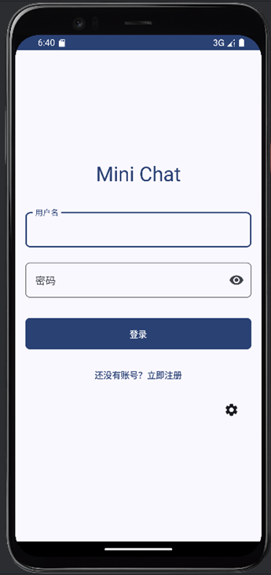
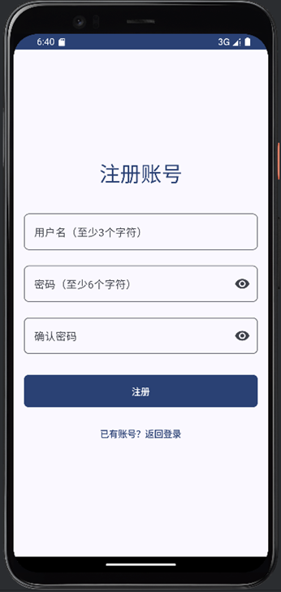
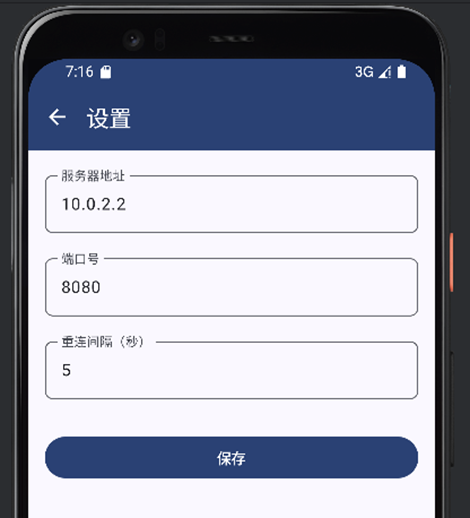
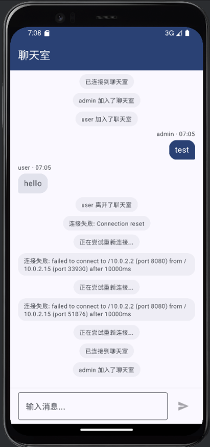

# MiniChatApp

**写在前面：代码结构部分参考了网络教程以及开源项目，由于本人是从零开始学app开发，可能存在一些bug敬请见谅**

开发工具：AndroidStudio+Copilot
项目版本：API26+GroovyDSL+gradle=8.5

主要依赖：
1. Hilt: 用于依赖注入
2. Retrofit + OkHttp: 用于网络请求
3. Room: 用于本地数据存储
4. Coil: 用于图片加载
5. 一个WebSocket服务器，SpringBoot源码在 `项目根目录/chatserver` 下

项目结构：

```
java
 └─com
    └─example
        └─minichatapp
            │  MainActivity.kt
            │  MiniChatApp.kt
            │  ProjectStructure.txt
            ├─data
            │  ├─local
            │  │      AppDatabase.kt
            │  │      AppSettings.kt
            │  │      ContactDao.kt
            │  │      MessageDao.kt
            │  │      UserDao.kt
            │  ├─remote
            │  │      ChatService.kt
            │  └─repository
            │          ContactRepository.kt
            │          MessageRepository.kt
            │          UserRepository.kt
            ├─di
            │      AppModule.kt
            │      DatabaseModule.kt
            │      NetworkModule.kt
            ├─domain
            │  └─model
            │          ChatMessage.kt
            │          ChatRoom.kt
            │          Contact.kt
            │          Converters.kt
            │          User.kt
            └─ui
                │  Navigation.kt
                ├─components
                │      CommonComponents.kt
                │      ImagePickerUtils.kt
                ├─navigation
                │      BottomNavItem.kt
                ├─screens
                │  │  MainScreen.kt
                │  ├─auth
                │  │      AuthViewModel.kt
                │  │      LoginScreen.kt
                │  │      RegisterScreen.kt
                │  ├─chat
                │  │      ChatScreen.kt
                │  │      ChatViewModel.kt
                │  │      ImageUtils.kt
                │  ├─contact
                │  │      AddContactDislog.kt
                │  │      ContactListScreen.kt
                │  │      ContactScreen.kt
                │  │      ContactViewModel.kt
                │  └─settings
                │          SettingsScreen.kt
                │          SettingsViewModel.kt
                └─theme
                        Color.kt
                        Theme.kt
                        Type.kt
```

## TodoList

1. Websocket服务器引线程池机制；
2. 将用户信息转移到服务器存储；
3. 添加用户个人简介、头像等功能。

## 应用示意图

1. 登录与注册界面
   

2. 设置界面

   

3. 聊天室界面

   
